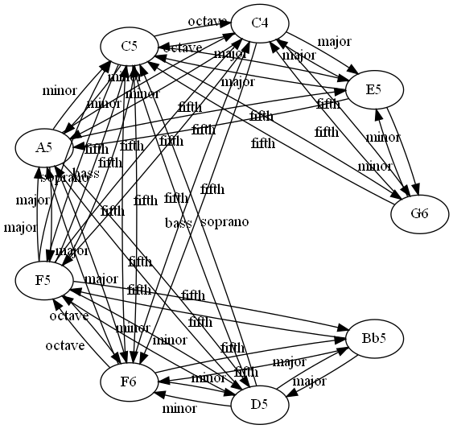

# TONNETZ-CAD
A Data-Set for GDL containing heterogeneous graphs produced by Tonnetz trajectories with cadence labels


Overview
--------

Cadence and Voice Leading Detection in Symbolic Classical Music is a challenging task. This Repository provides Datasets with different representations for applying Graph learning.




Motivation
--------
The original dataset contains the fully annotated scores but it presents some challenges for the task.

* **Boudaries of Cadences** The context boundaries of the cadences are ambiguous we solve this buy providing preassinged labels.
* **Complicated Representation** Essencially the format is enriched XML scores and tsv tables. We needed a setting that can be put to use directly for cadence segmentation in a Machine learning context.

We developed TONNETZ-CAD to address these issues. 

Getting the dataset
--------

Here's a minimal example of how to download the dataset:

```[python]
import requests, pickle

url = 'https://github.com/melkisedeath/tonnetzcad/raw/master/graph_classification/t345.pkl'
r = requests.get(url, allow_redirects=True)
open('./t345.pkl', 'wb').write(r.content)

with open('./t345.pkl', 'rb') as handle:
    data = pickle.load(handle)
    
data.keys()

>>> dict_keys(['x', 'x_test', 'y', 'y_test', 't', 'templates'])  # these are NumPy arrays
```

A slightly better way to do things is to clone this repo and then use the `get_dataset` method in `data.py` to do essentially the same thing.


Dimensionality reduction
--------

Visualizing the MNIST and MNIST-1D datasets with tSNE. The well-defined clusters in the MNIST plot indicate that the majority of the examples are separable via a kNN classifier in pixel space. The MNIST-1D plot, meanwhile, reveals a lack of well-defined clusters which suggests that learning a nonlinear representation of the data is much more important to achieve successful classification.


Constructing the dataset
--------
This is a synthetically-generated dataset which, by default, consists of 32 fully annotated Sonatas. The test sample contains 10 Sonatas but you can change that if you wish. Each example contains either the entire Tonnetz trajectory of a Sonata as graph in the Node Classification folder or a 2 bar segment Tonentz trajectory of a Sonata in the Graph Classification folder. You can of course choose in which Tonnetz you prefer the representation. These patterns are analogous to the cadences in the original [Mozart Piano Sonatas Data-Set](mozart_piano_sonatas).


Dependencies
--------
 * NumPy
 * PyTorch
 * DGL
 * 